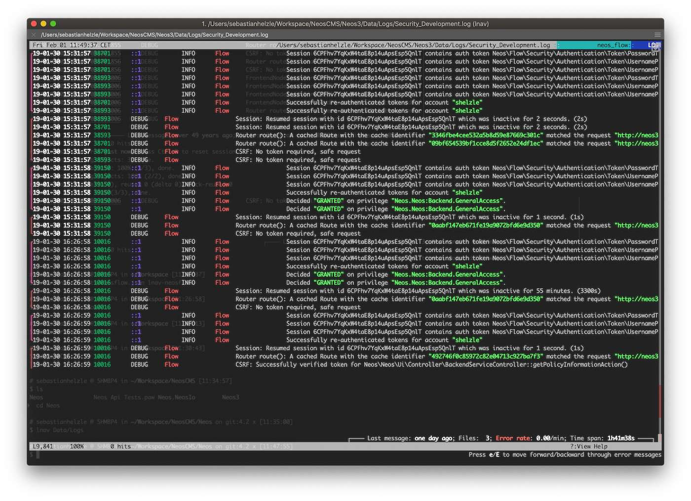

# lnav-neosflow

[Neos Flow](https://neos.io) log file format file for [lnav](https://lnav.org).

This allows you to view several log files in Neos Flow applications at the same time in one screen with highlighting.

## Installation

    lnav -i https://github.com/Sebobo/lnav-neosflow.git

## Usage example

Go to your Neos Flow project and run the following command:

    lnav Data/Logs

